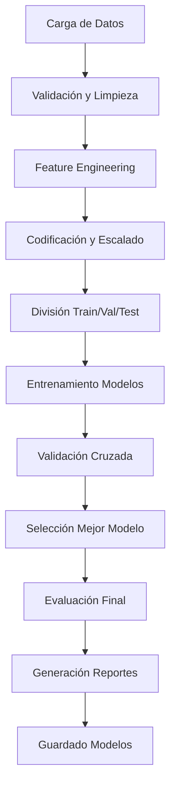

# 🤖 Pipeline de Machine Learning - MegaMercado

Un pipeline completo y robusto para el entrenamiento, evaluación y deployment de modelos de Machine Learning para el sistema de predicción de demanda de MegaMercado.

## 🎯 Características Principales

- **🔄 Pipeline Automatizado**: Preprocesamiento, entrenamiento y evaluación automática
- **🤖 Múltiples Modelos**: Soporte para 10+ algoritmos de ML
- **📊 Evaluación Completa**: Métricas detalladas y visualizaciones
- **🛠️ Configuración Flexible**: Ambientes de desarrollo y producción
- **📈 Monitoreo**: Tracking de performance y drift detection
- **🚀 CLI Integrado**: Interfaz de línea de comandos para automatización

## 🏗️ Arquitectura del Pipeline

```
ml_pipeline/
├── 📁 Core Components
│   ├── config.py              # Configuraciones centralizadas
│   ├── preprocessor.py        # Preprocesamiento de datos
│   ├── model_trainer.py       # Entrenamiento de modelos
│   └── pipeline.py           # Orquestador principal
│
├── 📁 Automation & CLI
│   ├── automation.py         # Automatización y CLI
│   └── ejemplo_uso.py        # Ejemplos de uso
│
├── 📁 Configuration
│   ├── requirements.txt      # Dependencias
│   └── README.md            # Esta documentación
│
└── 📁 Output Directories (creados automáticamente)
    ├── data/               # Datos procesados
    ├── models/            # Modelos entrenados
    ├── reports/           # Reportes y gráficas
    └── logs/              # Logs de ejecución
```

## 🚀 Inicio Rápido

### 1. Instalación

```bash
# Clonar o navegar al directorio del pipeline
cd ml_pipeline

# Crear entorno virtual (recomendado)
python -m venv venv
source venv/bin/activate  # Linux/Mac
# venv\Scripts\activate   # Windows

# Instalar dependencias
pip install -r requirements.txt
```

### 2. Uso Básico

```python
from pipeline import create_demand_prediction_pipeline

# Configurar rutas de datos
data_files = {
    'ventas': '../ventas.csv',
    'productos': '../productos.csv',
    'clientes': '../clientes.csv',
    'logistica': '../logistica.csv',
    'proveedores': '../proveedores.csv'
}

# Crear y ejecutar pipeline
pipeline = create_demand_prediction_pipeline(data_files, 'development')
results = pipeline.run_full_pipeline(
    data_files,
    target_column='cantidad_vendida',
    models_to_train=['random_forest', 'xgboost', 'linear_regression']
)

print(f"Mejor modelo: {results['training']['best_model']}")
```

### 3. Uso con CLI

```bash
# Ejecutar pipeline completo
python automation.py run --data-dir ../data --models random_forest xgboost

# Ejecutar experimentos en lote
python automation.py batch --data-dir ../data --config experiments.json

# Monitorear modelo existente
python automation.py monitor --model models/best_model.pkl --data new_data.csv
```

## 📋 Modelos Soportados

| Modelo | Tipo | Descripción |
|--------|------|-------------|
| **Linear Regression** | Lineal | Regresión lineal básica |
| **Ridge Regression** | Lineal | Regresión con regularización L2 |
| **Lasso Regression** | Lineal | Regresión con regularización L1 |
| **Elastic Net** | Lineal | Combinación Ridge + Lasso |
| **Random Forest** | Ensemble | Bosque de árboles de decisión |
| **Gradient Boosting** | Ensemble | Boosting secuencial |
| **XGBoost** | Ensemble | Extreme Gradient Boosting |
| **LightGBM** | Ensemble | Light Gradient Boosting |
| **Support Vector Regression** | Kernel | Regresión con SVM |
| **K-Nearest Neighbors** | Instance-based | Regresión basada en vecinos |

## 🔧 Configuración

### Ambientes Disponibles

#### Desarrollo (`development`)
- Entrenamiento rápido
- Sin optimización de hiperparámetros
- Logging detallado
- 3 folds de validación cruzada

#### Producción (`production`)
- Optimización completa de hiperparámetros
- 5 folds de validación cruzada
- Logging mínimo
- Evaluación exhaustiva

### Configuración Personalizada

```python
from config import MLConfig

# Crear configuración personalizada
config_personalizada = {
    'TARGET_COLUMN': 'mi_target',
    'HYPERPARAMETER_TUNING': True,
    'CV_FOLDS': 5,
    'MODELS_CONFIG': {
        'random_forest': {
            'params': {'n_estimators': 200},
            'grid_search_params': {
                'max_depth': [10, 20, 30]
            }
        }
    }
}

# Usar en pipeline
pipeline = MLPipeline('development', config_personalizada)
```

## 📊 Métricas de Evaluación

El pipeline calcula automáticamente las siguientes métricas:

- **MAE** (Mean Absolute Error)
- **MSE** (Mean Squared Error)  
- **RMSE** (Root Mean Squared Error)
- **R²** (Coefficient of Determination)
- **MAPE** (Mean Absolute Percentage Error)
- **Max Error** (Error máximo absoluto)

## 🎨 Visualizaciones Generadas

### 1. Comparación de Modelos
- Gráficas de barras comparando métricas
- Rankings de performance
- Análisis de validación cruzada

### 2. Análisis de Predicciones
- Scatter plot: Predicciones vs Valores Reales
- Análisis de residuos
- Distribución de errores

### 3. Feature Importance
- Importancia de variables por modelo
- Rankings comparativos
- Análisis SHAP (si disponible)

## 🔄 Flujo del Pipeline



## 🛠️ Preprocesamiento Automático

### Características Implementadas

1. **Manejo de Valores Faltantes**
   - Imputación por mediana (numéricos)
   - Imputación por moda (categóricos)

2. **Detección de Outliers**
   - Método IQR (Rango Intercuartílico)
   - Z-Score para casos extremos

3. **Feature Engineering**
   - Features temporales automáticos
   - Lag features configurables
   - Rolling windows
   - Features cíclicos

4. **Codificación**
   - Label Encoding (muchas categorías)
   - One-Hot Encoding (pocas categorías)
   - Escalado estándar (variables numéricas)

## 📁 Estructura de Salida

```
results/
├── 📁 models/                    # Modelos entrenados
│   ├── best_model.pkl           # Mejor modelo
│   ├── trained_models/          # Todos los modelos
│   └── model_comparison_report.csv
│
├── 📁 reports/                  # Reportes y gráficas
│   ├── models_comparison.png
│   ├── predictions_analysis.png
│   └── pipeline_report_*.json
│
├── 📁 data/processed/          # Datos procesados
│   ├── X_train.csv
│   ├── X_test.csv
│   └── preprocessor.pkl
│
└── 📁 logs/                    # Logs de ejecución
    └── ml_pipeline_*.log
```

## 🔮 Uso para Predicciones

```python
# Cargar modelo entrenado
from pipeline import MLPipeline

pipeline = MLPipeline()
model = pipeline.trainer.load_model('models/best_model.pkl')

# Realizar predicciones
import pandas as pd
nuevos_datos = pd.read_csv('datos_nuevos.csv')
predicciones = pipeline.predict_new_data(nuevos_datos)

print(f"Predicciones: {predicciones}")
```

## 🧪 Experimentos en Lote

Crear archivo `experiments.json`:

```json
{
  "experimento_basico": {
    "environment": "development",
    "models": ["linear_regression", "random_forest"]
  },
  "experimento_completo": {
    "environment": "production", 
    "models": ["random_forest", "xgboost", "lightgbm"]
  },
  "experimento_rapido": {
    "environment": "development",
    "models": ["linear_regression"]
  }
}
```

Ejecutar:
```bash
python automation.py batch --data-dir ../data --config experiments.json
```

## 📈 Monitoreo de Modelos

### Configuración de Umbrales

Crear `thresholds.json`:
```json
{
  "rmse_threshold": 100.0,
  "r2_threshold": 0.7,
  "mape_threshold": 15.0,
  "alert_email": "admin@megamercado.com"
}
```

### Monitoreo Automático
```bash
python automation.py monitor \
  --model models/best_model.pkl \
  --data new_data.csv \
  --thresholds thresholds.json
```

## 🔧 Casos de Uso Específicos

### 1. Predicción de Demanda
```python
from pipeline import create_demand_prediction_pipeline

pipeline = create_demand_prediction_pipeline(data_files)
results = pipeline.run_full_pipeline(data_files)
```

### 2. Segmentación de Clientes
```python
from pipeline import create_customer_segmentation_pipeline

pipeline = create_customer_segmentation_pipeline(data_files)
results = pipeline.run_full_pipeline(data_files)
```

## 🚀 Deployment y Producción

### Programación Automática
```bash
python automation.py schedule \
  --data-dir /path/to/data \
  --frequency daily \
  --models random_forest xgboost
```

### Integración con API
El pipeline se puede integrar fácilmente con APIs usando FastAPI:

```python
from fastapi import FastAPI
from pipeline import MLPipeline

app = FastAPI()
pipeline = MLPipeline()

@app.post("/predict")
async def predict(data: dict):
    predictions = pipeline.predict_new_data(pd.DataFrame(data))
    return {"predictions": predictions.tolist()}
```

## 🐛 Troubleshooting

### Problemas Comunes

1. **Error de memoria**: Reducir `n_estimators` en Random Forest/XGBoost
2. **Datos faltantes**: Verificar que las columnas esperadas existan
3. **Performance lenta**: Usar configuración 'development' para pruebas
4. **Dependencias**: Instalar con `pip install -r requirements.txt`

### Logs Detallados

Los logs se guardan automáticamente en `logs/ml_pipeline_*.log` con información detallada sobre cada paso del pipeline.

## 🤝 Contribución

Para contribuir al pipeline:

1. Fork el repositorio
2. Crea una rama para tu feature (`git checkout -b feature/nueva-funcionalidad`)
3. Commit tus cambios (`git commit -am 'Añadir nueva funcionalidad'`)
4. Push a la rama (`git push origin feature/nueva-funcionalidad`)
5. Crea un Pull Request

## 📝 Licencia

Este proyecto está bajo la Licencia MIT. Ver archivo `LICENSE` para más detalles.

## 🙋‍♂️ Soporte

Para soporte técnico o preguntas:

- 📧 Email: soporte@megamercado.com
- 📚 Documentación: [docs.megamercado.com](https://docs.megamercado.com)
- 🐛 Issues: [GitHub Issues](https://github.com/megamercado/ml-pipeline/issues)

---

**MegaMercado ML Pipeline v1.0** - Sistema de Machine Learning para Optimización de Inventarios y Predicción de Demanda